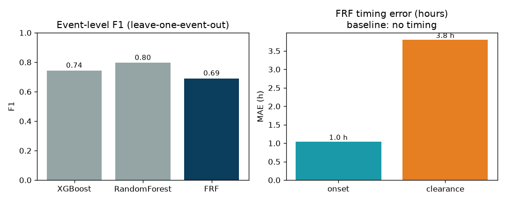

# AquaRoute — Evaluation (§8)

Auto-generated by `python -m aquaroute.eval.report`. All numbers come from
leave-one-event-out / held-out-storm validation; see the phase notes in the README.

## 1. Timing & depth — FRF vs baseline

The RF/XGBoost baseline predicts a flood/no-flood label with **no timing**. The
Flood Response Function matches its event-level F1 **and** predicts onset/peak/
clearance and depth.

| Model | Event F1 | ROC-AUC | Depth RMSE (m) | Onset MAE (h) | Clearance MAE (h) |
|---|---|---|---|---|---|
| XGBoost baseline | 0.7429 | 0.9257 | — (no depth) | — (no timing) | — (no timing) |
| RandomForest baseline | 0.7954 | 0.9501 | — | — | — |
| **Flood Response Function** | 0.6899 | 0.8838 | 0.0739 | 1.04 | 3.802 |

## 2. FRF per-event error (held-out storms)

| Event | Depth RMSE (m) | Onset MAE (h) | Clearance MAE (h) | Event F1 | ROC-AUC |
|---|---|---|---|---|---|
| 2015 chennai floods | 0.0689 | 1.225 | 5.204 | 0.7867 | 0.9164 |
| 2021 chennai floods | 0.0795 | 1.083 | 2.89 | 0.6314 | 0.8639 |
| 2023 cyclone michaung | 0.0732 | 0.813 | 3.311 | 0.6517 | 0.8712 |

## 3. Self-calibration — the 'road-fixed' test

A repaired segment's flood prediction retires **1 event(s)** after a
public-works event, and **1 event(s)** when the fix is silent
(caught by the change-point detector). A control segment stays flooded
(depth 0.51 m).

## 4. Routing regret per vehicle class (2021 replay, 18:00)

| Vehicle | Threshold (m) | Safe (km) | Shortest (km) | Detour (km) | Impassable on safe (km) | Impassable on shortest (km) |
|---|---|---|---|---|---|---|
| two-wheeler | 0.15 | 28.09 | 14.15 | 13.94 | 1.14 | 8.03 |
| auto | 0.25 | 27.03 | 14.15 | 12.88 | 0.49 | 7.38 |
| car | 0.3 | 26.71 | 14.15 | 12.56 | 0.44 | 7.32 |
| bus | 0.6 | 22.16 | 14.15 | 8.01 | 0.0 | 2.19 |

## 5. Validation protocol

- **Baseline / FRF**: leave-one-event-out over the 2015/2021/2023 storms; the FRF's
  temporal encoder is trained on synthetic storms so the three real storms are fully held out.
- **Self-calibration**: injected-repair test on chronically-flooded segments.
- **Routing**: safe vs shortest on the same forecast, per vehicle class.
