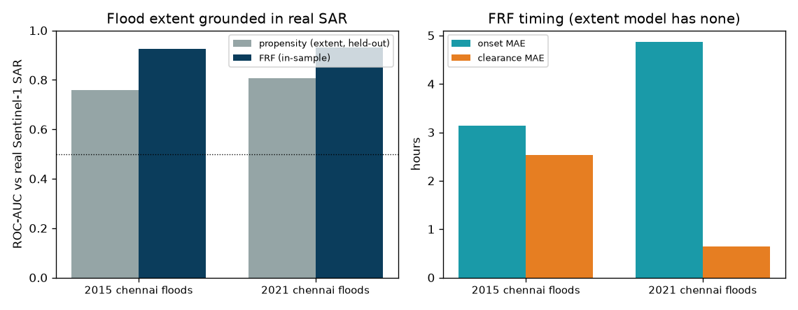
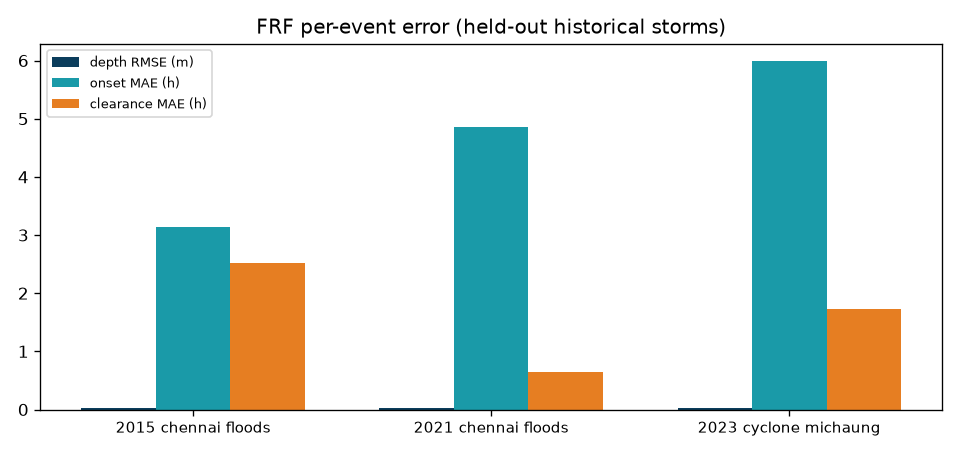
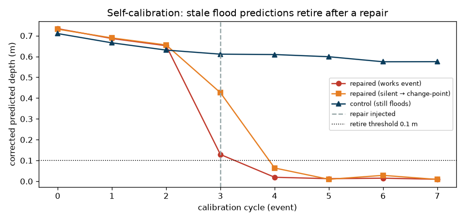
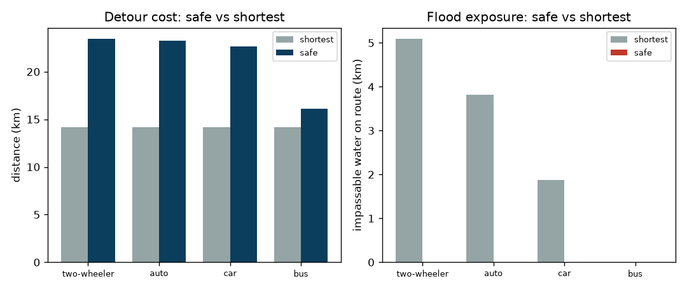

# AquaRoute — Evaluation (§8)

Auto-generated by `python -m aquaroute.eval.report`.

## 1. Flood extent grounded in real Sentinel-1 SAR

Which roads flood is learned from **real Sentinel-1 SAR** (2015 & 2021 events, Planetary Computer). A held-out test — train the flood-propensity model on one real event and score it on the *other* — shows it generalises (not memorised):

| Train → test | Held-out ROC-AUC (vs real SAR) |
|---|---|
| other → 2015 chennai floods | 0.759 |
| other → 2021 chennai floods | 0.807 |
| **mean** | 0.783 |

The Flood Response Function reconstructs depth = MAX_DEPTH · propensity · shape, so it ranks flood risk against real SAR **and** adds the depth-vs-time timing the extent model has no notion of:

| Real-SAR event | FRF ROC-AUC | Depth RMSE (m) | Onset MAE (h) | Clearance MAE (h) |
|---|---|---|---|---|
| 2015 chennai floods | 0.9255 | 0.0191 | 3.135 | 2.525 |
| 2021 chennai floods | 0.9303 | 0.0199 | 4.861 | 0.641 |

## 2. Architecture comparison (GAT vs GraphSAGE) & per-event error

| GNN | Mean ROC-AUC | Depth RMSE (m) | Onset MAE (h) | Clearance MAE (h) |
|---|---|---|---|---|
| graphsage | 0.8106 | 0.0193 | 4.42 | 1.605 |
| gat | 0.8113 | 0.0204 | 4.663 | 1.634 |

Best by AUC: **gat**. Per-event (all events; 2023 Michaung uses a synthetic mask — no SAR scene in its 12-day revisit gap — so its numbers are indicative only):

| Event | Depth RMSE (m) | Onset MAE (h) | Clearance MAE (h) | ROC-AUC |
|---|---|---|---|---|
| 2015 chennai floods | 0.0191 | 3.135 | 2.525 | 0.9255 |
| 2021 chennai floods | 0.0199 | 4.861 | 0.641 | 0.9303 |
| 2023 cyclone michaung | 0.0221 | 5.992 | 1.735 | 0.5782 |

## 3. Self-calibration — the 'road-fixed' test

A repaired segment's flood prediction retires **1 event(s)** after a
public-works event, and **1 event(s)** when the fix is silent
(caught by the change-point detector). A control segment stays flooded
(depth 0.58 m).

## 4. Routing regret per vehicle class (2021 replay, 18:00)

| Vehicle | Threshold (m) | Safe (km) | Shortest (km) | Detour (km) | Impassable on safe (km) | Impassable on shortest (km) |
|---|---|---|---|---|---|---|
| two-wheeler | 0.15 | 23.44 | 14.15 | 9.29 | 0.0 | 5.09 |
| auto | 0.25 | 23.28 | 14.15 | 9.13 | 0.0 | 3.81 |
| car | 0.3 | 22.64 | 14.15 | 8.49 | 0.0 | 1.87 |
| bus | 0.6 | 16.09 | 14.15 | 1.94 | 0.0 | 0.0 |

## 5. Validation protocol

- **Flood extent**: real Sentinel-1 SAR (change detection on Planetary Computer, keyless).
  Propensity generalisation held out one real event from the other.
- **FRF timing**: temporal encoder trained on synthetic storms; the three historical storms
  are held out for validation. Depth/onset/clearance are vs the reservoir physics; ROC-AUC is vs real SAR.
- **Self-calibration**: injected-repair test on chronically-flooded segments.
- **Routing**: safe vs shortest on the same forecast, per vehicle class.
